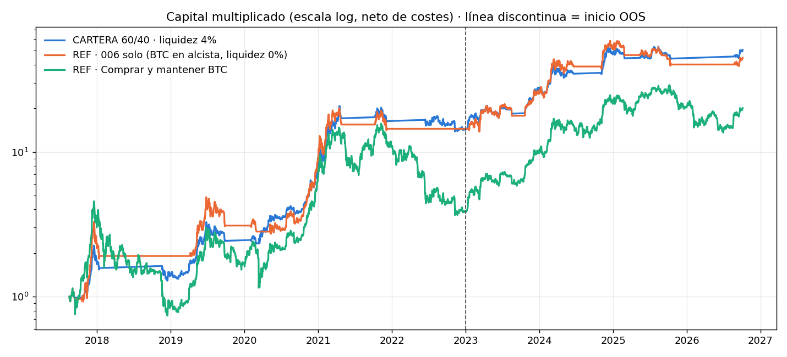

# crypto-regime-portfolio

Combines the validated pieces of projects **006 → 008** into one portfolio, to use the capital each system leaves idle. **No new trading rules** — only allocation.

| Sleeve | Weight | Rule |
|---|---|---|
| **Core** | 60% | BTC when [006](https://github.com/ivanalonso-dev/btc-regime-detector) says bull (strong or weak); when not bull, [008](https://github.com/ivanalonso-dev/crypto-bear-regime-system)'s S2 (BTC only if MVRV < 1), otherwise cash |
| **Satellite** | 40% | [007](https://github.com/ivanalonso-dev/crypto-bull-regime-system) v2 trend system, 1% risk per trade, 19 coins |
| **Idle cash** | — | earns 4% a year (stablecoin / T-bill assumption); 0% variant shown |

Monthly rebalancing to 60/40 with 0.10% cost on the traded amount. Period 2017-08 → 2026-10; in-sample < 2023 ≤ out-of-sample.

**Pre-registered adoption rule:** Calmar above "006 alone" (BTC in bull regime, cash at 0% otherwise) in total and out-of-sample, **and** max drawdown better than −35%.

## Results

| Portfolio | CAGR | Max DD | Sharpe | Calmar | OOS CAGR | OOS max DD | OOS Calmar |
|---|---|---|---|---|---|---|---|
| **60/40, cash 4%** | **53.6%** | **−42.9%** | **1.43** | **1.25** | 40.1% | **−19.9%** | **2.01** |
| 60/40, cash 0% | 50.0% | −44.9% | 1.36 | 1.11 | 36.8% | −22.8% | 1.62 |
| 80/20, cash 4% *(sensitivity)* | 59.5% | −52.3% | 1.34 | 1.14 | 43.6% | −24.3% | 1.79 |
| 40/60, cash 4% *(sensitivity)* | 46.7% | −31.2% | 1.51 | 1.50 | 36.0% | −20.1% | 1.79 |
| Core only (006 + S2) | 64.4% | −60.1% | 1.26 | 1.07 | 46.7% | −32.1% | 1.46 |
| Satellite only (007 v2, 1%) | 30.4% | −24.8% | 1.23 | 1.22 | 26.6% | −23.2% | 1.15 |
| *006 alone* | 51.6% | −44.4% | 1.20 | 1.16 | 35.1% | −33.2% | 1.05 |
| *Buy & hold BTC* | 38.9% | −83.8% | 0.83 | 0.46 | 55.1% | −53.1% | 1.04 |



**Verdict under the pre-registered rule: not adopted.** The 60/40 portfolio beats 006 alone on every metric — higher return, higher Sharpe, higher Calmar (1.25 vs 1.16 total, **2.01 vs 1.05 out-of-sample**) and a slightly smaller drawdown — but its maximum drawdown (−42.9%, Dec 2017 → Dec 2018) breaks the −35% limit. With a 60% BTC core, the 2018 crash before the regime detector reacts is unavoidable; the limit turned out to be stricter than the benchmark itself (−44%).

Other findings:
- The diversification benefit is real: combining a high-return, high-drawdown sleeve (006) with a low-correlated, lower-return one (007) lifts out-of-sample Calmar from ~1.1–1.5 to 2.0.
- The 4% yield on idle cash adds ~3.5 points of CAGR.
- S2 (MVRV < 1 accumulation) **hurt** the core in this window (Calmar 1.07 vs 1.16 for 006 alone): its Nov 2018 entry deepened the 2018 drawdown.
- The 40/60 mix would meet all three conditions, but it was a sensitivity case; picking it now would be selection after seeing results. Choosing a lower BTC weight is a legitimate **risk-tolerance** decision, documented as such.

## Broker costs: retail stress test (eToro, 1% per side)

The backtest above assumes 0.10% per side, typical of a crypto exchange. eToro charges **1% per side** on crypto for Bronze/Silver/Gold members, so the portfolio was re-run with that cost applied to every core switch, every satellite trade and every monthly rebalance (`python portfolio.py --fee-pct 1`).

| Portfolio (cash 4%) | Fee / side | CAGR | Max DD | OOS CAGR | OOS max DD | OOS Calmar |
|---|---|---|---|---|---|---|
| **60/40** | 0.10% | 53.5% | −42.9% | 39.8% | −19.9% | 2.00 |
| **60/40** | **1.00%** | **48.2%** | **−44.2%** | **33.6%** | **−25.0%** | **1.34** |
| Core only (006 + S2) | 1.00% | 59.4% | −61.6% | 41.3% | −36.8% | 1.12 |
| Satellite only (007 v2, 1%) | 1.00% | 25.1% | −30.7% | 19.0% | −25.2% | 0.76 |
| *006 alone (cash 0%)* | 1.00% | 47.1% | −46.2% | 29.8% | −39.0% | 0.77 |
| *Buy & hold BTC* | — | 38.7% | −83.8% | 54.5% | −53.1% | 1.03 |

Effect of the yield on idle cash, at 1% fees: **60/40 with cash at 0%: 44.7% CAGR, OOS Calmar 1.06 · with cash at 4%: 48.2%, OOS Calmar 1.34.**

**Reading:** at retail costs the portfolio keeps a risk-adjusted advantage over buy-and-hold BTC out of sample, but a smaller one. The core barely notices (few switches a year); the **trend satellite absorbs most of the cost** (a 2% round trip per trade cuts its OOS Calmar from 1.14 to 0.76). Running the satellite on a low-fee venue, and the core wherever is convenient, is the obvious mitigation. FX conversion fees and spread widening are not modelled.

## Limitations

- Same caveats as 006–008: few cycles, survivorship in the coin universe, regime detector chosen after seeing 2020–26.
- Cash yield assumed flat at 4%; stablecoin yield carries counterparty/platform risk.
- Rebalancing assumed frictionless apart from fees.

## Usage

Requires the 006, 007 and 008 folders next to this one (with their data downloaded):

```bash
pip install -r requirements.txt
python portfolio.py                 # --yield-pct 4 --risk 1 --fee-pct 0.10 (eToro: --fee-pct 1)
```

Prints today's allocation (core in BTC or cash; satellite positions from 007). `run_daily.bat` runs it after 006, 007 and 008.

### Personal dashboard, daily plan and cash ledger

```bash
python registrar.py aportacion 20000 "capital inicial"     # deposits / withdrawals
python registrar.py compra-nucleo 0.14 86000                 # core BTC
python registrar.py compra SOL 5.35 112.7 --sl 97.8          # satellite trade with stop-loss
python registrar.py retirada 500 "para mamá"
python dashboard.py                                          # -> dashboard.html
```

`dashboard.html` shows the BTC regime (006) and the active system (007 in bull, 008 otherwise), **today's actions** — buys, sells and stop-loss raises with quantity, amount, stop-loss and the command to record them — sized with the *real* capital from the ledger (deposits − withdrawals ± results), current positions, cash movements and an equity chart. `plan.py` writes the same plan as text (`plan_hoy.txt`). `run_daily.bat` regenerates everything after 006, 007 and 008; `registrar.py` regenerates the dashboard after each record.

Settings live in `mi_cartera.json` (core weight, risk per trade, stop mode `intradia` / `cierre`, broker commission, available coins). The system uses **no take profit**: exits are the trailing stop-loss. Personal files (`mi_cartera.json`, `mi_registro/`, `plan_hoy.txt`, `dashboard.html`) are git-ignored.

---
*Author: Ivan Alonso · [github.com/ivanalonso-dev](https://github.com/ivanalonso-dev)*
